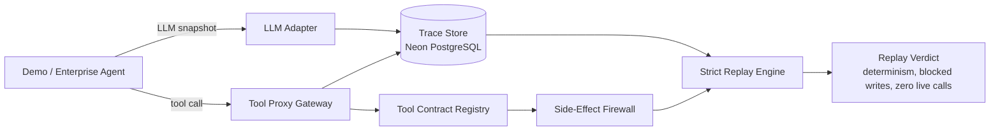
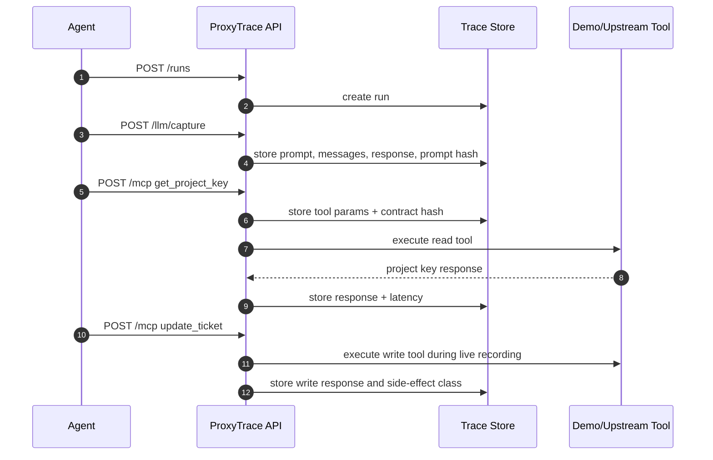
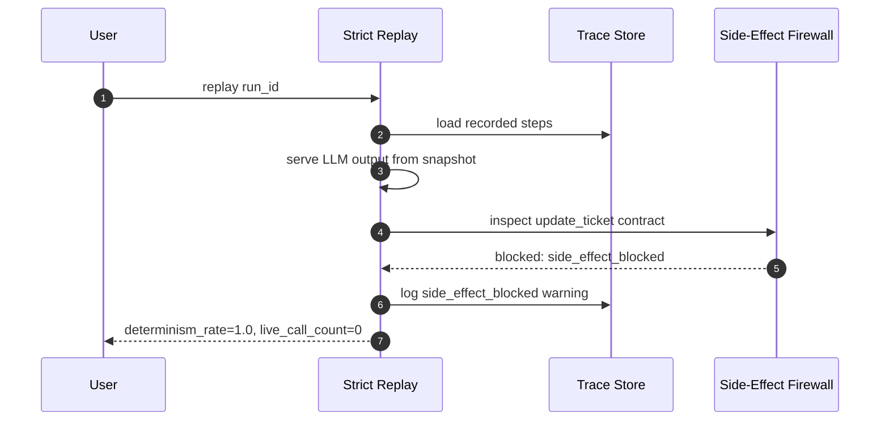

<div align="center">

# ProxyTrace

Side-effect-safe execution tracing and deterministic replay for enterprise AI agents.

**AINS Hackathon 2026 · Use Case 2 · Agent Execution Tracer & Deterministic Replay Engine**

</div>

---

ProxyTrace is the flight recorder for Jira AI agents. It records every LLM decision and tool call, replays incidents without touching live Jira, blocks side effects during replay, and turns failures into inspectable evidence.

Core loop:

```text
record -> replay -> patch -> diff -> explain -> regress
```

## Why This Wins

When a traditional system fails, engineers reproduce the bug. When an AI agent fails, rerunning it may produce a different trajectory or trigger the same live side effect again. ProxyTrace closes that infrastructure gap:

- full trajectory capture: LLM prompts, model responses, tool calls, payloads, latency, status, and context snapshots;
- deterministic strict replay: recorded LLM and tool responses are served from the trace store, with zero live calls;
- side-effect firewall: write and destructive tools are blocked during replay and logged as warnings;
- tool contract registry: every tool has a replay policy, schema hash, trust level, and side-effect class;
- evaluation-ready data: the 20-trace label set is already present in `proxytrace/data/labels.json`.

This maps directly to the AINS Use Case 2 must-have criteria: record functionality, deterministic replay, state inspection, and a foundation for divergence editing.

## Phase 1 Status

Built now:

- FastAPI backend at `proxytrace.proxy.main:app`
- async SQLAlchemy trace store for Neon PostgreSQL
- tables/models for `runs`, `steps`, `tool_contracts`, `replays`, `regression_pack`, and `drift_warnings`
- MCP-style tool proxy endpoint at `POST /mcp`
- LLM capture endpoint at `POST /llm/capture`
- Gemini SDK monkey-patch for automatic `google.genai.Client.models.generate_content(...)` capture
- demo Jira triage agent with two tools:
  - `get_project_key` as a read tool
  - `update_ticket` as a write tool
- strict replay endpoint at `POST /runs/{run_id}/replay/strict`
- sequence-based replay determinism metrics, including matching step count and mismatches
- side-effect firewall that blocks `update_ticket` during strict replay
- default contracts and schema hashes for the demo tools
- Phase 4 evaluation labels drafted early, as required by the winning plan

Planned next:

- route-level hardening for regression endpoints
- replay history endpoint if needed by the frontend
- React/Forge UI

## Architecture



Live recording:



Strict replay:



## Quick Start

Set `DATABASE_URL` to the Neon pooled PostgreSQL connection string with `sslmode=require`.

```powershell
python -m venv .venv
.\.venv\Scripts\Activate.ps1
python -m pip install -e ".[dev]"
Copy-Item .env.example .env
# edit .env and paste the Neon pooled DATABASE_URL
python -m proxytrace.db.init_db
uvicorn proxytrace.proxy.main:app --reload
```

In a second terminal, record a demo trace:

```powershell
.\.venv\Scripts\Activate.ps1
python -m proxytrace.agent_demo.run_demo --issue-key DEMO-1 --summary "API deploy pipeline fails" --description "The platform release pipeline fails after an API change."
```

Copy the `run_id` from the output and run strict replay:

```powershell
$runId = "<run_id>"
Invoke-RestMethod -Method Post "http://localhost:8000/runs/$runId/replay/strict"
```

Expected replay properties:

- `determinism_rate` is `1.0`
- `live_call_count` is `0`
- `update_ticket` is marked `side_effect_blocked`
- a `side_effect_blocked` warning is written for the replayed write tool

## Neon + Render + Forge Path

Day 0 / production-like setup from the winning plan:

1. Create a Neon project named `proxytrace`.
2. Use the pooled PostgreSQL connection string as `DATABASE_URL`.
3. Deploy the FastAPI backend on Render so Atlassian Forge can reach it.
4. Set `GEMINI_API_KEY` and `GEMINI_MODEL=gemini-3.1-flash-lite`.
5. Hit `GET /health` on the Render URL.
6. Use the Render URL as the Forge Remote backend base URL.

The judging/demo target is Neon PostgreSQL + Render FastAPI backend + Forge.

## API Surface

| Endpoint | Purpose |
|---|---|
| `GET /health` | service health check |
| `POST /runs` | start an agent run |
| `GET /runs` | list recorded runs, optionally filtered by Jira issue key |
| `GET /runs/{run_id}` | inspect run metadata and all steps |
| `GET /runs/{run_id}/warnings` | inspect firewall and drift warnings |
| `POST /llm/capture` | record an LLM prompt/response snapshot |
| `POST /mcp` | proxy and record a tool call |
| `POST /runs/{run_id}/complete` | mark a run completed or failed |
| `POST /runs/{run_id}/replay/strict` | replay from recorded snapshots with the firewall enabled |
| `POST /runs/{run_id}/replay/exploratory` | apply a prompt/tool-result patch and compare the branched trajectory |
| `POST /replay/exploratory` | same exploratory replay flow with `run_id` in the JSON body |
| `POST /regression/promote` | freeze an exploratory replay into regression assertions |
| `GET /regression` | list promoted regression tests |
| `POST /regression/run-all` | run frozen regression assertions |

Current regression limitation: `run-all` validates frozen trace consistency and final-state assertions without re-executing a fresh live agent run. True production regression testing will replay a new agent version and compare it against the frozen assertions.

## Repository Structure

```text
proxytrace/
  agent_demo/       demo Jira triage agent and runner
  contracts/        schema hashing and default tool contract registry
  db/               SQLAlchemy models, sessions, repository helpers, init script
  llm_adapter/      LLM prompt/response capture helpers
  proxy/            FastAPI app, routes, MCP-style tool proxy, demo tools
  replay/           strict replay engine and side-effect firewall
  data/
    labels.json     20 human labels for evaluator ground truth
tests/
  test_*.py         initial contract/firewall tests
```

## Evaluation Labels

`proxytrace/data/labels.json` contains the planned 20-trace evaluation set:

- 5 clean runs
- 4 wrong tool argument failures
- 4 wrong tool selection failures
- 3 untrusted context injection failures
- 2 wrong tool order failures
- 2 schema drift warnings

These labels are written before scorer implementation to avoid tuning the evaluator to its own output.

## Hackathon Roadmap

Phase 1, Days 1-2: record, strict replay, side-effect firewall.

Phase 2, Days 3-4: patch engine, exploratory replay, divergence diff, hybrid evaluator, regression pack.

Phase 3, Days 5-6: React/Vite frontend and Forge issue panel integration.

Phase 4, Day 7: 20-trace evaluation run, metrics report, demo video, final submission polish.

---

Built for AINS Hackathon 2026, Use Case 2, with Vectors as the commercial target.
